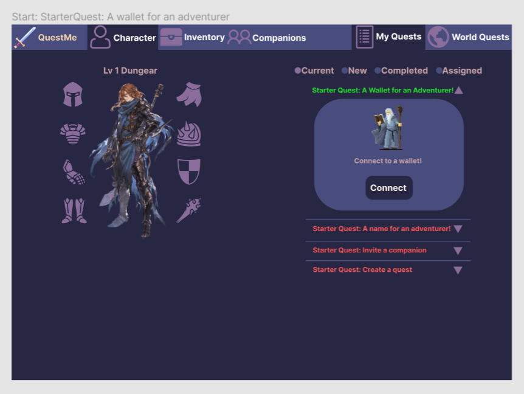

## QuestMe

QuestMe is an incentive app for people to assign quests to others and obtain rewards in cryptocurrency on completion.



## Getting Started

First, set up the Moralis API keys in the .env.local file. You can obtain the keys by signing up to [Moralis](https://moralis.io/)

First, run the development server:

```bash
npm run dev
```

Open [http://localhost:3000](http://localhost:3000) with your browser to see the result.

## Deploy on Vercel

The easiest way to deploy your Next.js app is to use the [Vercel Platform](https://vercel.com/new?utm_medium=default-template&filter=next.js&utm_source=create-next-app&utm_campaign=create-next-app-readme) from the creators of Next.js.

Check out our [Next.js deployment documentation](https://nextjs.org/docs/deployment) for more details.
